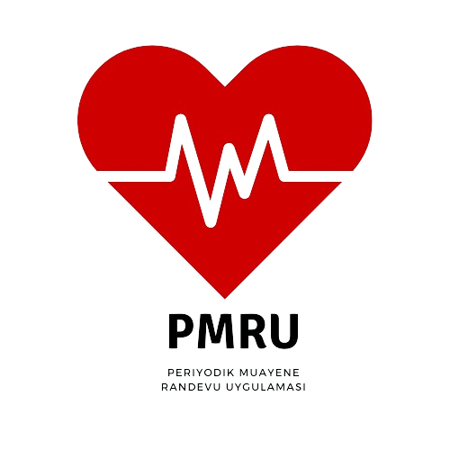
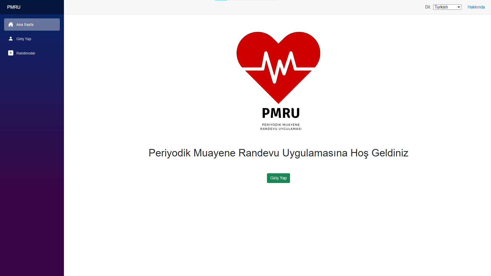
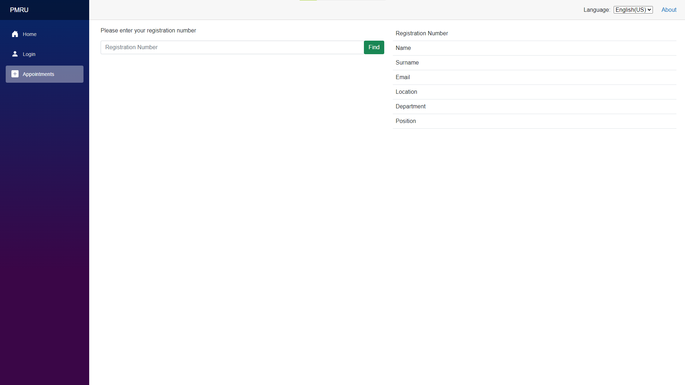
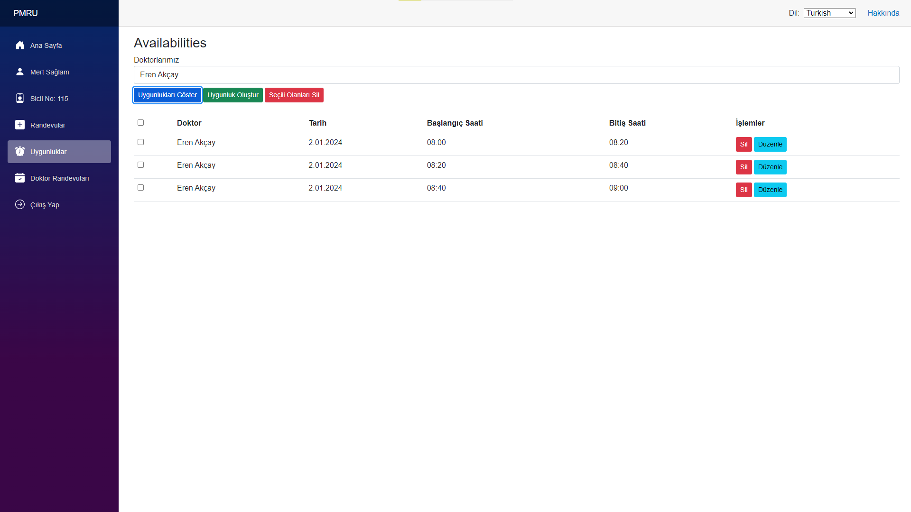
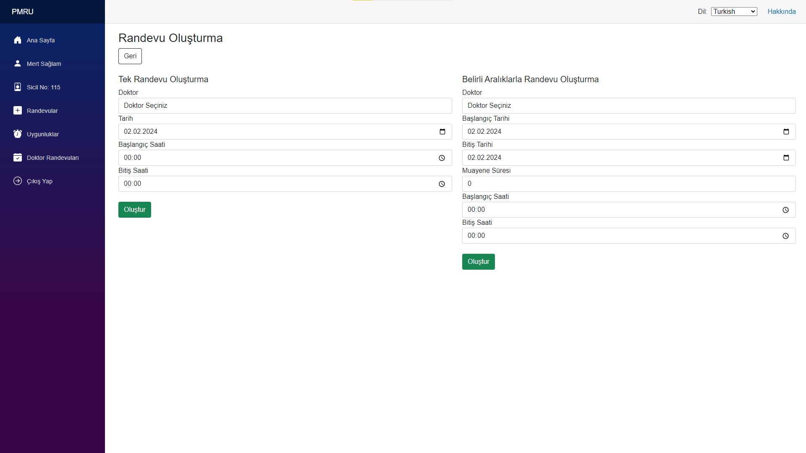
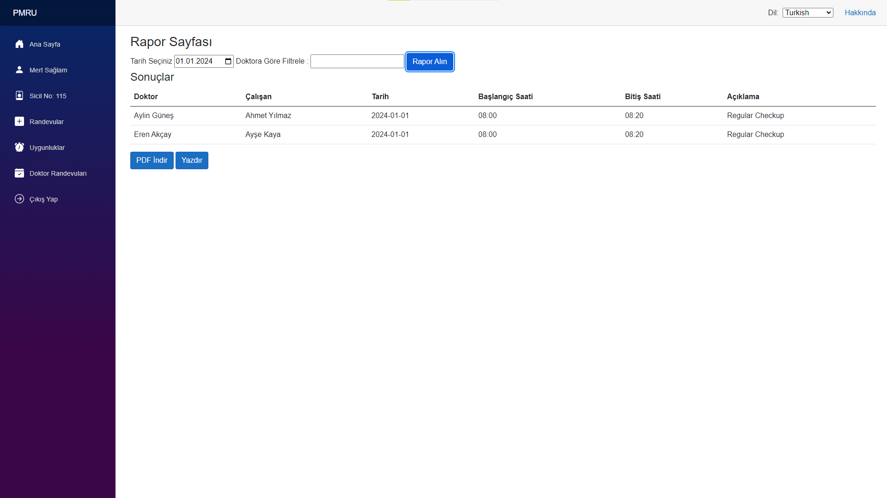

<h1 align="center"><b>PMRU </b></h1>
<h3 align="center"><b>Periyodik Muayene Randevu Uygulaması </b></h3>

<!-- PROJECT LOGO -->
 

  
  

  <h2 align="center">PMRU</h2>

  

    Empowering Health and Efficiency: PMRU, Where Appointments Meet Simplicity! 
     
     
    <a href="https://www.youtube.com/watch?v=vdEs70DmBwI">Demo</a>
    ·
    <a href="https://github.com/batuhanpayal/PMRU/issues">Report Bug</a>
    ·
    <a href="https://github.com/batuhanpayal/PMRU/issues">Request Feature</a>
  

<!-- TABLE OF CONTENTS -->

  
Table of Contents

  <ol>
    <li>
        <a href="#about-the-project">About the Project</a>
      <ul>
        <li><a href="#what-is-travelbrew">What is PMRU ?</a></li>
      </ul>
       <ul>
        <li><a href="#built-with">Built With</a></li>
      </ul>
    </li>
    <li><a href="#screens">Project Images</a></li>
    <li><a href="#roadmap">Roadmap</a></li>
    <li><a href="#project-team">Project Team</a></li>
    <li><a href="#license">License</a></li>
  </ol>

<!-- ABOUT THE PROJECT -->

## About the Project ✨

###  What is PMRU❔
 
The PMRU project is a comprehensive web application designed to streamline and enhance the appointment management process within a company or organization. This intuitive platform caters to the needs of employees, doctors, and administrators, providing a seamless experience for scheduling, monitoring, and managing appointments.
 
 

    

  </a>

  

Click for [Documentation]()

### Benefits:

Improves overall efficiency in appointment management.
Enhances communication and coordination between employees and healthcare professionals.
Provides administrators with valuable insights through data analytics and reporting.

### 🗝️ Key Features:

* Employee-Friendly Appointment Booking: Employees can schedule appointments through an easy-to-use interface.
* Flexible Appointment Management: View, modify, or cancel existing appointments.
* Profile Information: Access and update personal information within the system.
* Appointment Overview: Access a dashboard or list of scheduled appointments.
* Appointment Details: View details of each appointment, including patient information.
* User Management: Create, update, and delete user accounts (employees, doctors).
* Authentication and Authorization: Secure access control to ensure that only authorized users can perform specific actions.
* User-friendly Interface: Intuitive design to make it easy for users to navigate and perform actions.
* Notifications: Automated emails or notifications for appointment confirmations, reminders, or changes.

### 💻 Built With

[![DotNetCore][DotNetCore]][DotNetCore-url]  [![C#][c#]][Csharp-url]  
The project was developed using .NET Core and C#. During the development process, a strong foundation was established by focusing on the SOLID principles in software design and Clean Architecture principles. These principles aimed to make the code clear, understandable, and easy to maintain, while also striving to provide a sustainable and flexible code architecture. Using ASP.NET Core for RESTful API design, an interactive and reliable API was developed over the HTTP protocol.

For data access and management, Entity Framework was preferred, and NuGet packages such as AutoMapper and MediatR enhanced the modularity of the application by following patterns such as Command Query Responsibility Segregation (CQRS) and Mediator Pattern. AutoMapper automated object mapping processes, while MediatR provided a mediator structure to handle events and requests. Blazor was employed for the UI layer, developing the web application's UI layer and enabling the use of C# code on the browser side, ensuring a consistent language on both the server and client sides.

The integration of RedisCache was added to the project, resulting in faster operations and an enhanced user experience. Additionally, with Localization support, users can utilize the application in their preferred language. These enhancements elevated the project's performance, providing a user-friendly experience and raising the overall quality of the project.

The development took place in the Visual Studio environment and was managed through GitHub. Trello was used for project management, facilitating the tracking of the development process, enhancing collaboration within the team, and providing an effective tool for planning, monitoring, and completing tasks. This technological infrastructure was brought together to expedite the project development process and elevate the quality of the application.

<a href="#readme-top">Back to the Top ↑ </a>

<!-- SCREENS EXAMPLES -->
##
### 📱 Project Imagess

You can see the project screenshots below.
 
 

<a>

  
  

  

  
    

      

   
    

 
  

  </a>

  

_For Demo, please click to the [link](https://www.youtube.com/watch?v=vdEs70DmBwI)_

<!-- ROADMAP -->
##
### 🗺️ Roadmap

- [ ] Create Database
- [ ] Create API project
- [ ] Add Nuget Packages
- [ ] Code the pages
- [ ] Run and test the project
- [ ] Make deployment and presentation
- [ ] Add and organize the readme

See the [open issues](https://github.com/batuhanpayal/PMRU/issues) for a full list of proposed features (and known issues).

<a href="#readme-top">Back to the Top ↑ </a>

<!-- PROJECT-TEAM-->
## 👩‍💻 Project Team

* Batuhan PAYAL - [GitHub](https://github.com/batuhanpayal) | [LinkedIn](https://www.linkedin.com/in/emirbatuhanpayal/)
* Doğa DEMİRTÜRK -  [GitHub](https://github.com/dogademirturk) | [LinkedIn](https://www.linkedin.com/in/dogademirturk/)
* Musa OCAK -[GitHub](https://github.com/musaocak1) | [LinkedIn](https://www.linkedin.com/in/musaocak/)
* Yağmur Baran KARAKUŞ - [GitHub](https://github.com/yagmurbarank) |  [LinkedIn](https://www.linkedin.com/in/yagmurbarankarakus/) 

 

<a href="#readme-top">Back to the Top ↑ </a>

<!-- LICENSE -->
## 📜 License

Distributed under the MIT License. See `license` for more information.

 

<!-- MARKDOWN LINKS & IMAGES -->

[product-screenshot]: images/screenshot.png
[DotNetCore]: https://img.shields.io/badge/8-%2320232a.svg?style=flat&logo=dotnet&logoColor=#512BD4
[DotNetCore-Url]: https://dotnet.microsoft.com/en-us/
[C#]:https://img.shields.io/badge/-%2320232a.svg?style=flat&logo=csharp&logoColor=Q2BD4
[Csharp-url]: https://dotnet.microsoft.com/en-us/languages/csharp
